# iOS native Bundle IDs
A comperhensive list of natively installed iOS applications Bundle IDs. Please note that this list does not iclude all apps that Apple has made available through app store. 

  
  
  

## Notice
* Some of these apps are native only in a specific regions. 
* List is based on native iPhone apps and does not reflect iPad or iPadOS apps.
* App names will reflect the latest naming scheme.
* Icons used will reflect the latest design.

| Icon | App name | 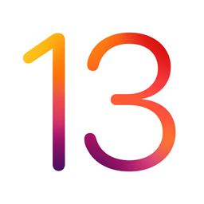 | 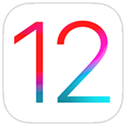 |  | 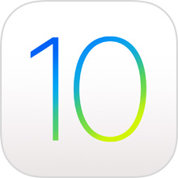 |  | 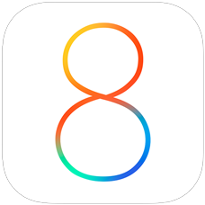 |  |  |  |  | iOS 3 | iOS 2 | iOS 1 |
|--------------|-----------------------------|-----------------------------|-----------------------------|-----------------------------|-----------------------------|----------------------|----------------------|----------------------|-----------------------------|-------|-------|-------|-------|-------|
|  | App Store | com.apple.AppStore | com.apple.AppStore | com.apple.AppStore | com.apple.AppStore | com.apple.AppStore | com.apple.AppStore | com.apple.AppStore | com.apple.AppStore | com.apple.AppStore |  |  |  |  |
|  | Books | com.apple.iBooks | com.apple.iBooks | com.apple.iBooks | com.apple.ibooks | com.apple.iBooks |  |  |  |  |  |  |  |  |
|  | Calculator | com.apple.calculator | com.apple.calculator | com.apple.calculator | com.apple.calculator | com.apple.calculator | com.apple.calculator | com.apple.calculator |  |  |  |  |  |  |
| 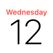 | Calendar | com.apple.mobilecal | com.apple.mobilecal | com.apple.mobilecal | com.apple.mobilecal | com.apple.mobilecal | com.apple.mobilecal | com.apple.mobilecal | com.apple.mobilecal | com.apple.mobilecal |  |  |  |  |
|  | Camera | com.apple.camera | com.apple.camera | com.apple.camera | com.apple.camera | com.apple.camera | com.apple.camera | com.apple.camera | com.apple.camera | com.apple.camera |  |  |  |  |
|  | Clips | com.apple.clips | com.apple.clips | x | x | x | x | x | x | x | x | x | x | x |
| 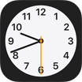 | Clock | com.apple.mobiletimer | com.apple.mobiletimer | com.apple.mobiletimer | com.apple.mobiletimer | com.apple.mobiletimer | com.apple.mobiletimer | com.apple.mobiletimer | com.apple.mobiletimer | com.apple.mobiletimer |  |  |  |  |
|  | Compass | com.apple.compass | com.apple.compass | com.apple.compass | com.apple.compass | com.apple.compass |  |  |  |  |  |  |  |  |
|  | Contacts | com.apple.MobileAddressBook | com.apple.MobileAddressBook | com.apple.MobileAddressBook | com.apple.MobileAddressBook | com.apple.MobileAddressBook | com.apple.MobileAddressBook | com.apple.MobileAddressBook | com.apple.MobileAddressBook | com.apple.MobileAddressBook |  |  |  |  |
|  | FaceTime | com.apple.facetime | com.apple.facetime | com.apple.facetime | com.apple.facetime | com.apple.facetime |  |  |  |  |  |  |  |  |
|  | Files | com.apple.DocumentsApp | com.apple.DocumentsApp | com.apple.DocumentsApp | x | x | x | x | x | x | x | x | x | x |
|  | Find Friends | x | com.apple.mobileme.fmf1 | com.apple.mobileme.fmf1 | com.apple.mobileme.fmf1 | com.apple.mobileme.fmf1 |  |  |  |  |  |  |  |  |
|  | Find iPhone | x | com.apple.mobileme.fmip1 | com.apple.mobileme.fmip1 | com.apple.mobileme.fmip1 | com.apple.mobileme.fmip1 |  |  |  |  |  |  |  |  |
|  | Find My | com.apple.findmy | x | x | x | x | x | x | x | x | x | x | x | x |
| 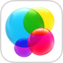 | Game Center | x | x | x | x | com.apple.gamecenter | com.apple.gamecenter | com.apple.gamecenter | com.apple.gamecenter | com.apple.gamecenter |  |  |  |  |
|  | Health | com.apple.Health | com.apple.Health | com.apple.health | com.apple.health | com.apple.Health |  |  |  |  |  |  |  |  |
|  | Home | com.apple.Home | com.apple.Home | com.apple.Home | com.apple.home | x |  |  |  |  |  |  |  |  |
|  | iCloud Drive | com.apple.iCloudDriveApp | com.apple.iCloudDriveApp | com.apple.iclouddriveapp | com.apple.iclouddriveapp | x |  |  |  |  |  |  |  |  |
|  | iTunes Store | com.apple.MobileStore | com.apple.MobileStore | com.apple.MobileStore | com.apple.mobilestore | com.apple.MobileStore |  |  |  |  |  |  |  |  |
|  | Mail | com.apple.mobilemail | com.apple.mobilemail | com.apple.mobilemail | com.apple.mobilemail | com.apple.mobilemail | com.apple.mobilemail | com.apple.mobilemail | com.apple.mobilemail | com.apple.mobilemail |  |  |  |  |
| 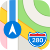 | Maps | com.apple.Maps | com.apple.Maps | com.apple.Maps | com.apple.Maps | com.apple.Maps | com.apple.Maps | com.apple.Maps |  |  |  |  |  |  |
| 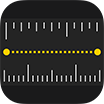 | Measure | com.apple.measure | com.apple.measure | x | x | x | x | x | x | x | x | x | x | x |
|  | Messages | com.apple.MobileSMS | com.apple.MobileSMS | com.apple.MobileSMS | com.apple.MobileSMS | com.apple.MobileSMS |  |  |  |  |  |  |  |  |
|  | Music | com.apple.Music | com.apple.Music | com.apple.Music | com.apple.Music | com.apple.Music |  |  |  | com.apple.mobileipod |  |  |  |  |
| 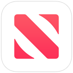 | News | com.apple.news | com.apple.news | com.apple.news | com.apple.news | com.apple.news |  |  |  |  |  |  |  |  |
| 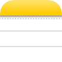 | Notes | com.apple.mobilenotes | com.apple.mobilenotes | com.apple.mobilenotes | com.apple.mobilenotes | com.apple.mobilenotes | com.apple.mobilenotes | com.apple.mobilenotes |  |  |  |  |  |  |
|  | Phone | com.apple.mobilephone | com.apple.mobilephone | com.apple.mobilephone | com.apple.mobilephone | com.apple.mobilephone |  |  |  |  |  |  |  |  |
|  | Photo Booth | x | com.apple.Photo-Booth | com.apple.Photo-Booth | x | x | x | x | x | x | x | x | x | x |
|  | Photos | com.apple.mobileslideshow | com.apple.mobileslideshow | com.apple.mobileslideshow | com.apple.mobileslideshow | com.apple.mobileslideshow | com.apple.mobileslideshow | com.apple.mobileslideshow | com.apple.mobileslideshow | com.apple.mobileslideshow |  |  |  |  |
|  | Podcasts | com.apple.podcasts | com.apple.podcasts | com.apple.podcasts | com.apple.podcasts | com.apple.podcasts |  |  |  |  |  |  |  |  |
| 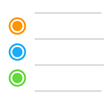 | Reminders | com.apple.reminders | com.apple.reminders | com.apple.reminders | com.apple.reminders | com.apple.reminders | com.apple.reminders | com.apple.reminders |  |  |  |  |  |  |
| 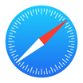 | Safari | com.apple.mobilesafari | com.apple.mobilesafari | com.apple.mobilesafari | com.apple.mobilesafari | com.apple.mobilesafari | com.apple.mobilesafari | com.apple.mobilesafari | com.apple.mobilesafari | com.apple.mobilesafari |  |  |  |  |
|  | Settings | com.apple.Preferences | com.apple.Preferences | com.apple.Preferences | com.apple.Preferences | com.apple.Preferences | com.apple.Preferences | com.apple.Preferences | com.apple.Preferences | com.apple.Preferences |  |  |  |  |
|  | Shortcuts | is.workflow.my.app | is.workflow.my.app | x | x | x | x | x | x | x | x | x | x | x |
|  | Stocks | com.apple.stocks | com.apple.stocks | com.apple.stocks | com.apple.stocks | com.apple.stocks |  |  |  |  |  |  |  |  |
|  | Tips | com.apple.tips | com.apple.tips | com.apple.tips | com.apple.tips | com.apple.tips |  |  |  |  |  |  |  |  |
|  | TV | com.apple.tv | com.apple.tv | com.apple.tv | com.apple.tv |  |  |  |  |  |  |  |  |  |
|  | Videos | x | com.apple.videos | com.apple.videos | com.apple.videos | com.apple.videos | com.apple.videos | com.apple.videos |  |  |  |  |  |  |
| 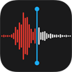 | Voice Memos | com.apple.VoiceMemos | com.apple.VoiceMemos | com.apple.voicememos | com.apple.voicememos | com.apple.VoiceMemos |  |  |  |  |  |  |  |  |
|  | Wallet | com.apple.Passbook | com.apple.Passbook | com.apple.passbook | com.apple.passbook | com.apple.Passbook | com.apple.Passbook | com.apple.Passbook |  |  |  |  |  |  |
| 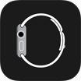 | Watch | com.apple.Bridge | com.apple.Bridge | com.apple.bridge | com.apple.bridge | com.apple.Bridge |  |  |  |  |  |  |  |  |
|  | Weather | com.apple.weather | com.apple.weather | com.apple.weather | com.apple.weather | com.apple.weather |  |  |  |  |  |  |  |  |

## Sources
Joe Blau's work was a big help when starting this list: https://github.com/joeblau/apple-bundle-identifiers
